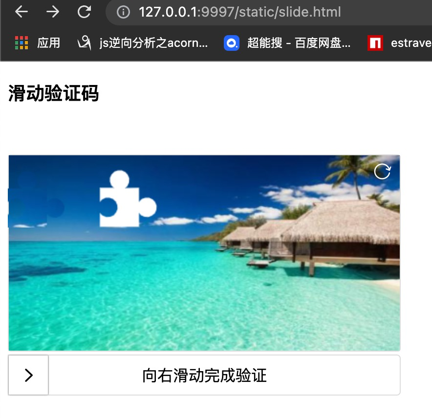

## golang 人机验证插件 [点选验证，滑动验证] 加密传输 验证库

## 使用方法
- 当作插件(库)使用
```
// get it 
go get -u github.com/bugfan/captcha

// import it
import(
    "github.com/bugfan/captcha"
)

// run it，then you can use at your logic
go func(){
    err:=captcha.Start(":9997")
    log.Fatal(err)
}()

// open it on browser
'http://127.0.0.1:9997/static/position.html'
or
'http://127.0.0.1:9997/static/slide.html'
```
- 简易模式使用
```
// run test
cd captcha
go test

// open it on browser
'http://127.0.0.1:9997/static/position.html'
or
'http://127.0.0.1:9997/static/slide.html'
```
## 效果
- 滑动

- 点选


### 需要不同的页面显示效果，去‘web’目录下修改对应的js，html等文件代码即可